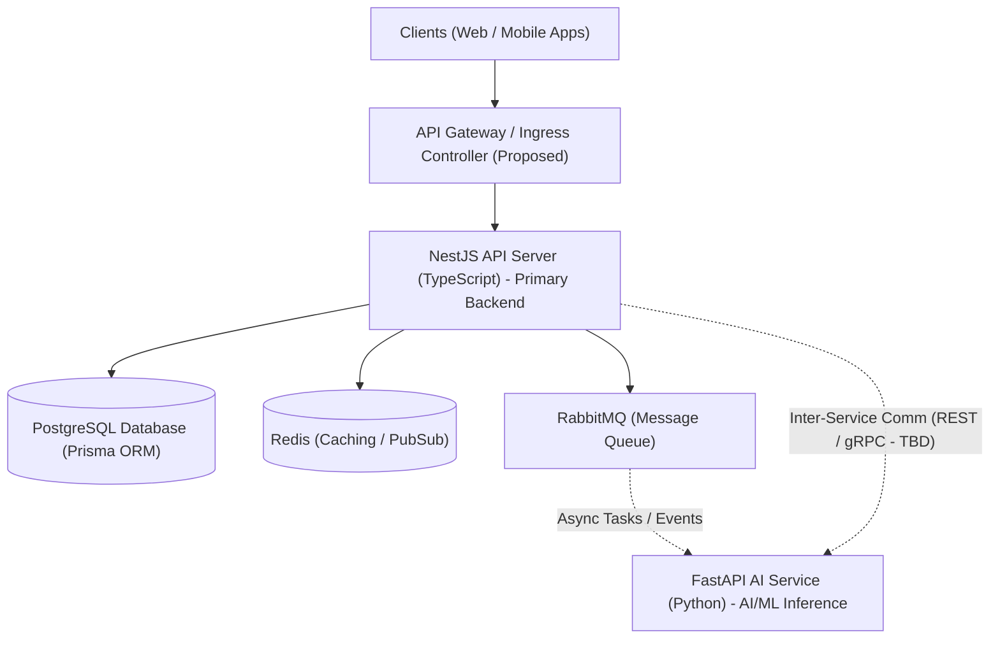

# System Architecture

> **Document Status**: DRAFT / PROPOSED ARCHITECTURE  
> **Last Updated**: 2026-09-19  
> **Notice**: All architectural decisions in this document are **PROPOSED / DRAFT** and require formal team review and approval before implementation.

---

## 1. Current State

**No architecture exists.** The repository is completely empty except for a placeholder `README.md`. There are no services, build files, configuration manifests, or deployment pipelines currently implemented.

---

## 2. Proposed High-Level Architecture (DRAFT)

The proposed design organizes the system as a monorepo containing two core services alongside data and messaging infrastructure.

### Proposed Services

1. **NestJS API Server (TypeScript)** — *Primary Backend*
   - Handles client-facing requests, authentication, business domain logic, database operations, and external API integrations.
   - Intended to use Prisma ORM for database access.
2. **FastAPI AI Service (Python)** — *AI/ML Inference and Processing*
   - Handles specialized AI/ML workflows, vision processing, model inference, and RAG pipelines.

### Data and Messaging Components

- **Database**: PostgreSQL (single database instance; schema managed by Prisma)
- **Caching Layer**: Redis (intended for in-memory caching and session/pub-sub needs)
- **Message Queue**: RabbitMQ (intended for asynchronous task offloading, background processing, and event distribution)

### Inter-Service Communication

- **Communication between NestJS and FastAPI**: `UNKNOWN — REQUIRES DECISION`
  - Candidate options: REST (HTTP/JSON), gRPC (Protobuf), or asynchronous message queuing via RabbitMQ.
  - Final transport and contract: `TBD — REQUIRES TEAM DECISION`.

---

## 3. High-Level Architecture Diagram (PROPOSED)

---

## 4. Proposed Infrastructure (DRAFT)

- **Local Development**: Docker Compose (proposed for coordinating NestJS, FastAPI, PostgreSQL, Redis, and RabbitMQ containers locally).
- **Production Deployment**: `TBD — REQUIRES TEAM DECISION` (Cloud provider, orchestrator such as Kubernetes/ECS, and hosting architecture not yet decided).

---

## 5. Architectural Decisions Required

| Decision Area | Status | Options Under Consideration |
| :--- | :--- | :--- |
| **Monorepo vs. Polyrepo** | PROPOSED (Monorepo) | Single repository vs separate repositories |
| **Inter-Service Communication** | UNKNOWN — REQUIRES DECISION | REST, gRPC, RabbitMQ async messaging |
| **API Gateway Solution** | UNKNOWN — REQUIRES DECISION | NGINX, Traefik, Kong, or NestJS reverse proxy |
| **AI Model Hosting** | UNKNOWN — REQUIRES DECISION | Self-hosted models, external API providers, or hybrid |
| **Object Storage Provider** | UNKNOWN — REQUIRES DECISION | AWS S3, Cloudflare R2, MinIO, GCP Storage |
| **Production Hosting Environment** | UNKNOWN — REQUIRES DECISION | AWS, GCP, Azure, Bare-metal / VPS |

---

## 6. Resumption Guide for Future Agents

Future development agents must:
1. Confirm team approval of the monorepo structure and service boundaries before creating directories.
2. Confirm the inter-service protocol between NestJS and FastAPI before authoring network clients.
3. Validate Docker Compose service definitions with the team before standardizing local developer tooling.
