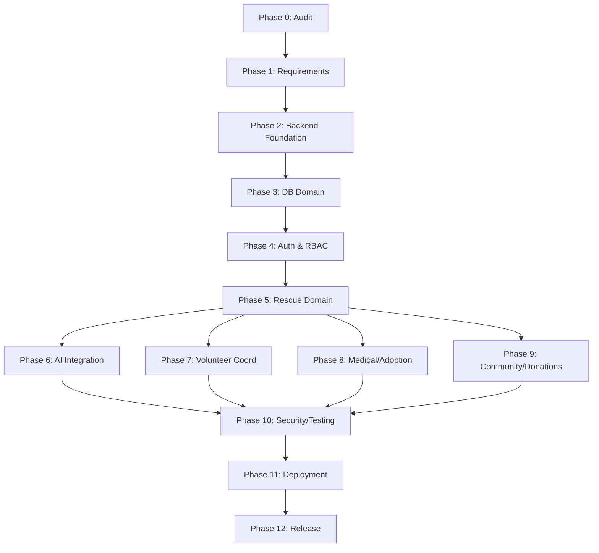

# Development Roadmap

> **Status**: DRAFT — REQUIRES TEAM APPROVAL  
> **Last Updated**: 2026-09-19  
> **Updated By**: AI Agent (Antigravity)

## Overview

The Bezubaan Helping Hands project is following a 13-phase implementation sequence (Phase 0 to 12). 

> [!IMPORTANT]
> All phases below are **DRAFT**. They require team review and approval before execution begins.

---

## Phase 0 — Repository Audit + Foundation
**Goal**: Set up the initial repository, documentation structure, and auditing.
**Status**: ✅ COMPLETED

## Phase 1 — Product Requirements + Domain Specification
**Goal**: Formally establish verified product requirements without speculative implementation.
**Status**: ✅ COMPLETED

## Phase 2 — Backend Foundation
**Goal**: Initialize NestJS, Docker, Database connections, and linting.
**Status**: ✅ COMPLETED *(Originally executed as Phase 0)*

## Phase 3 — Database + Core Domain
**Goal**: Design the Prisma schema for confirmed foundational entities (User, Rescue, Animal).
**Status**: ⏳ PENDING (Blocked by Product Decisions)

## Phase 4 — Authentication + Users + RBAC
**Goal**: Implement secure user registration, JWT/OAuth, and role-based access control.
**Status**: ⬜ NOT STARTED

## Phase 5 — Animal + Rescue Domain
**Goal**: Implement the core rescue workflow, case state machine, and animal tracking APIs.
**Status**: ⬜ NOT STARTED

## Phase 6 — AI Service + AI Integration
**Goal**: Scaffold the FastAPI service, Vision model integration, and RAG logic for triage.
**Status**: ⬜ NOT STARTED

## Phase 7 — Volunteer + Rescue Coordination
**Goal**: Build volunteer dispatch logic, geolocation routing, and acceptance workflows.
**Status**: ⬜ NOT STARTED

## Phase 8 — Medical + Adoption + Foster
**Goal**: Expand the domain to cover veterinary records, and post-rescue lifecycle.
**Status**: ⬜ NOT STARTED

## Phase 9 — Community + Donations + Notifications
**Goal**: Add social features, payment gateways, and Firebase push notifications.
**Status**: ⬜ NOT STARTED

## Phase 10 — Integration + Security + Testing
**Goal**: End-to-end testing, OWASP hardening, rate limiting, and architecture review.
**Status**: ⬜ NOT STARTED

## Phase 11 — Production Hardening + Deployment
**Goal**: Container orchestration, CI/CD pipelines, observability (logging/metrics).
**Status**: ⬜ NOT STARTED

## Phase 12 — Final Audit + Release Readiness
**Goal**: Security audit, documentation finalization, and MVP release.
**Status**: ⬜ NOT STARTED

---

## Dependencies Between Phases

